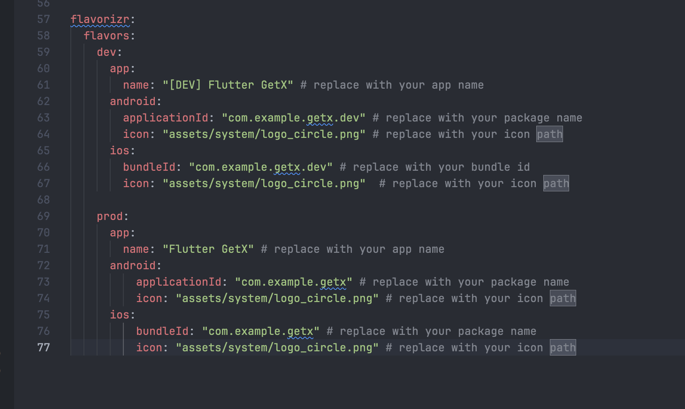
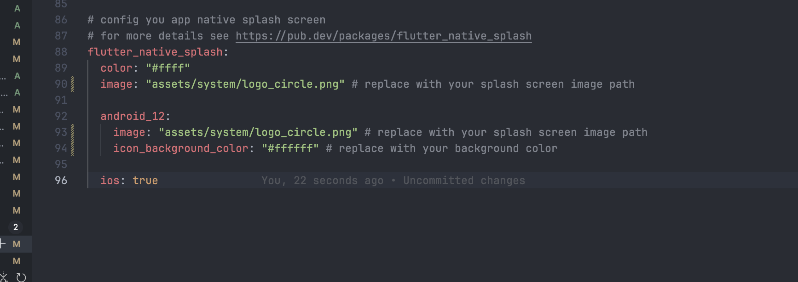
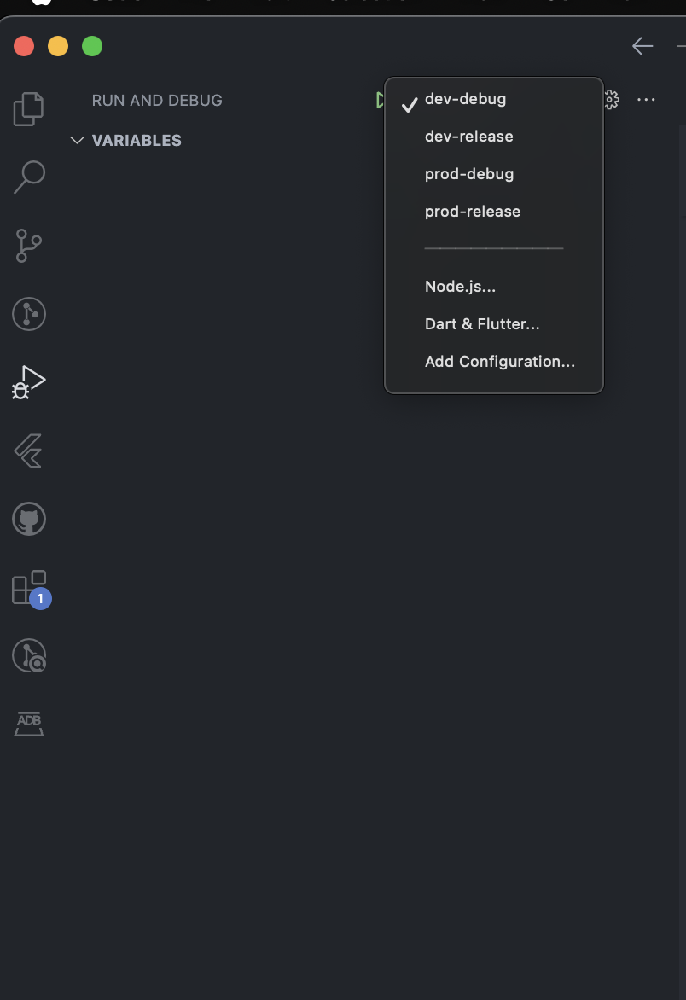

# Flutter Boilerplate Template

## Introduce
This Flutter Boilerplate Template is designed to accelerate the development of scalable and maintainable mobile applications. It provides a pre-configured structure that includes essential tools and best practices for building modern Flutter apps.

##  Key Features
- **State Management with GetX**
>Simplify state management, dependency injection, and navigation using the powerful and lightweight GetX package.

- **Multi-Language Support**:
> Built-in internationalization to easily localize your app for multiple languages, ensuring a global reach.

- **Multi-Environment Configuration**:
> Effortlessly manage different app configurations (e.g., dev, prod) with environment-based setup.

- **Native splash screen**
  
---

## Folder structure

The following is the project folder structure (only the folders under lib are introduced)

```
lib/
|- api - Global Restful api requests, including interceptors, etc.
   |- interceptors - Interceptors, including auth, request, and response interceptors.
   |- api.dart - Restful api export file.
|- lang - Internationalization, including translation files, translation service files, etc.
   |- lang.dart - Language export file.
|- models - Various structured entity classes, divided into request and response entities.
   |- models.dart - Entity class export file.
|- modules - Business module folder.
   |- auth - Login & Registration Module.
   |- home - Home module.
   |- splash - Splash module.
   |- modules.dart - Module export file.
|- routes - Routing module.
   |- app_pages.dart - Routing page configuration.
   |- app_routes.dart - Route names.
   |- routes.dart - Route export file.
|- Shared - Global shared folders, including static variables, global services, utils, global Widgets, etc.
   |- shared.dart - Global shared export file.
|- theme - Theme folder.
|- app_bindings.dart - Services started before the app runs, such as Restful api.
|- di.dart - Global dependency injection objects, such as SharedPreferences, etc.
|- main.dart - Main entry.
```

---

## Requirements

- **Flutter**: 3.29.0  
  > It is recommended to use [FVM](https://fvm.app/) for managing Flutter versions.

- **Xcode**: Version 15.0 or higher  

- **Android Studio**
---

## Configuration

**Step 1:** Update fields in `pubspec.yaml` same as:
- `appName`
  
- `bundleId`
  
- `icon`: your logo path 

- `firebase`: if you want to use [firebase](https://firebase.google.com/docs/flutter/setup)



> Splash native screen
- `image`: your logo 
- `color`: background color splash native screen



**Step 2:** 
- Create new file `.env.dev` and `.env.prod` in the root project if not exist
- Run the following command in the terminal:  
   ```bash
   # created model 
   flutter packages pub run build_runner build 

   #NOTE: if conflict the model generate
   flutter packages pub run build_runner build --delete-conflicting-outputs

   # install dependencies
   flutter pub get

   # generated flavor code
   flutter pub run flutter_flavorizr

   # generate splash native screen
   dart run flutter_native_splash:create
   ```

**Step 3:** 
1. Replace class `App` in `lib/app.dart` to   
```dart

class App extends StatelessWidget {
  const App({super.key});

  @override
  Widget build(BuildContext context) {
    return GestureDetector(
      onTap: () => FocusScope.of(context).unfocus(),
      child: GetMaterialApp(
        title: F.title,
        debugShowCheckedModeBanner: false,
        enableLog: true,
        initialRoute: AppPages.initial,
        defaultTransition: Transition.cupertino,
        getPages: AppPages.routes,
        initialBinding: AppBinding(),
        smartManagement: SmartManagement.keepFactory,
        theme: ThemeConfig.lightTheme,
        darkTheme: ThemeConfig.darkTheme,
        locale: Locale(StorageService.lang ??
            TranslationService.fallbackLocale.languageCode),
        fallbackLocale: TranslationService.fallbackLocale,
        translations: TranslationService(),
        builder: EasyLoading.init(),
        themeMode:
            StorageService.themeMode == 2 ? ThemeMode.dark : ThemeMode.light,
      ),
    );
  }
}

```
2. Replace `lib/main.dart`
```dart

FutureOr<void> main() async {
  WidgetsFlutterBinding.ensureInitialized();
  final fileName = F.appFlavor == Flavor.dev ? ".env.dev" : ".env.prod";
  await dotenv.load(fileName: fileName);
  await DependencyInjection.init();

  runApp(App());

  configLoading();
}

void configLoading() {
  EasyLoading.instance
    ..indicatorType = EasyLoadingIndicatorType.threeBounce
    ..loadingStyle = EasyLoadingStyle.custom
    // ..indicatorSize = 45.0
    ..radius = 10.0
    // ..progressColor = Colors.yellow
    ..backgroundColor = ColorConstants.lightGray
    ..indicatorColor = hexToColor('#64DEE0')
    ..textColor = hexToColor('#64DEE0')
    // ..maskColor = Colors.red
    ..userInteractions = false
    ..dismissOnTap = false
    ..animationStyle = EasyLoadingAnimationStyle.scale;
}

```
> **Note**:You can customize the configLoading function to suit your project's needs.

**Step 4:** Notification config (optional)

1. Config [firebase notification](https://firebase.google.com/docs/cloud-messaging/flutter/client)
2. Config [flutter_local_notifications](https://pub.dev/packages/flutter_local_notifications)
3. Uncomment file [`notification_services`](lib/shared/services/notification_services.dart) 
4. Uncomment line 10 in `lib/di.dart`

---
## Debug
Select environment and run app with [Visual Studio Code](https://docs.flutter.dev/development/tools/vs-code#run-app-in-debug-profile-or-release-mode) or [Android Studio and IntelliJ](https://docs.flutter.dev/development/tools/android-studio#running-and-debugging)


---

## Usage

↳ **Image**
```dart
         ImageWidget(
          <your path>, // ex: asset/image/logo.pnd | asset/image/logo.svg | https://image.png
          width: 100,
          height: 100,
          radius: 0,
          borderRadius: const BorderRadius.all(Radius.circular(0)), // default: 12
        ),
```

↳ **Button**
```dart
   ButtonWidget(
      text: "login".tr,
      onPressed: controller.onLogin,
      type: ButtonType.primary, // ButtonType.primary | ButtonType.outline | ButtonType.text
   )
```

↳ **Size**
- <num>.w: width screen
- <num>.h: height screen
- <num>.wp: percent screen width
- <num>.hp: percent screen height
  
```dart
   // example
   10.w = (10 / design width ) * 100;   
   10.h = (10/ design height ) * 100;
   10.wp = (screen width * 10 ) / 100; // 10% screen width
   10.hp = (screen height * 10 ) / 100; // 10% screen height
```

↳ **Color** (only use color in ColorScheme)

```dart
   // get colorScheme 
   final colorScheme = context.colors;
   // primary color
   final primary = colorScheme.primary; // link mode: Color(0xFF006FFD) | dark mode: Color(0xFF6FBAFF)

   // see more color in lib/shared/constants/colors.dart
   
```
 
↳ **Local storage**
1. Create a new key inside `lib/shared/constants/storage.dart` (ex: newKey)
```dart
   static String? get <newKey> =>
      _sharedPreferences?.getString(StorageConstants.newKey);
  static set token(String? value) =>
      _sharedPreferences?.setString(StorageConstants.newKey, value ?? '');
``` 
2. Use in the project
```dart
   // get value
   final value = StorageService.newKey;
   // set value
   StorageService.newKey = 'value';
```
↳ **Language**

1. Crete new key inside [en_US](lib/lang/en_US.dart) and [vi_VN](lib/lang/vi_VN.dart)
2. Basic call: *your-key*.tr
3. Call with params
```dart
   // en_US.dart
   "hello": "Hello, my name is @name"

   // use
   'hello'.trParams({'name': 'Emily'})
```
↳ **Loading**
1. AppLoading
```dart
   // replace function configLoading flow your app loading loading inside lib/main.dart
   // basic usage
   EasyLoading.show(); // to show
   
   EasyLoading.dismiss(); // to hide
```

2. ShimmerLoading

```dart

   // basic usage
   ShimmerLoadingContainer(
        type: LoadingType.page, || LoadingType.list | LoadingType.grip  
        isLoading: isLoading,
        child: YourWidget(),
   )

   // custom
   ShimmerLoadingContainer(
        type: LoadingType.custom,
        isLoading: !controller.isInitialized.value,
        child: YourWidget(),
        loadingView: Colum(
         children: [
            ShimmerBaseWidget.image(
               width: double.infinity,
               height: 30.wp,
            ),
            ShimmerBaseWidget.atv(
               size: 30.wp,
            ),

            // more code
            // ref: lib/shared/widgets/loading/shimmer_base_widget.dart
         ],
        )
        
   )
```

↳ **Environment**
 
```dart
// example usage
// add key in .env.dev
BASE_URL=https://api.dev.com

// add key in .env.prod
BASE_URL=https://api.prod.com

// use in the project
final baseUrl = dotenv.env['BASE_URL'];

```
 
---
## Other

### Extension for create model: [json to dart](https://marketplace.visualstudio.com/items?itemName=hirantha.json-to-dart)

### Api use in the project: [dummyjson](https://dummyjson.com/)
Default test user:
- username: `emilys`
- password: `emilyspass`  
